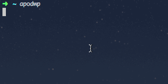

# apod-wp 
a simple cli tool that fetches the latest high resolution [APOD (Astronomy Picture Of the Day)](https://apod.nasa.gov/apod/astropix.html) from NASA, writes the explanation (written by a professional astronomer) on the image and sets it as your desktop wallpaper. works on windows, linux and mac. It's one simple command that's easy to schedule to run on an interval or on startup/login etc.

## prerequisites 
[node 6.9 or greater](https://nodejs.org/en/)

## install
```
npm install apod-wp -g
```

## run with demo API key (limited number of API calls)
```
apodwp
```



## run with your own API key (recommened)
* Go to [NASA Open API's](https://api.nasa.gov/#live_example) and request an API key. You have to fill in 4 textboxes and click one button and you receive it instantly. Couldn't be easier!

* Now you can run the command with your API Key like so:
```
apodwp ThisIsYourKeyButItDoesntReallyLookLikeThis
```

## props
This is built on some lovely npm packages:  
[wallpaper](https://github.com/sindresorhus/wallpaper)  
[Jimp](https://github.com/oliver-moran/jimp)  
[shelljs](https://github.com/shelljs/shelljs)  
[superagent](https://github.com/visionmedia/superagent)  

And it is consuming the open API [APOD](https://api.nasa.gov/api.html#apod) from NASA.

#### License

Released under the MIT license. Copyright (c) 2017 Johan Hellgren.

Permission is hereby granted, free of charge, to any person obtaining a copy of this software and associated documentation files (the "Software"), to deal in the Software without restriction, including without limitation the rights to use, copy, modify, merge, publish, distribute, sublicense, and/or sell copies of the Software, and to permit persons to whom the Software is furnished to do so, subject to the following conditions:

The above copyright notice and this permission notice shall be included in all copies or substantial portions of the Software.

THE SOFTWARE IS PROVIDED "AS IS", WITHOUT WARRANTY OF ANY KIND, EXPRESS OR IMPLIED, INCLUDING BUT NOT LIMITED TO THE WARRANTIES OF MERCHANTABILITY, FITNESS FOR A PARTICULAR PURPOSE AND NONINFRINGEMENT. IN NO EVENT SHALL THE AUTHORS OR COPYRIGHT HOLDERS BE LIABLE FOR ANY CLAIM, DAMAGES OR OTHER LIABILITY, WHETHER IN AN ACTION OF CONTRACT, TORT OR OTHERWISE, ARISING FROM, OUT OF OR IN CONNECTION WITH THE SOFTWARE OR THE USE OR OTHER DEALINGS IN THE SOFTWARE.